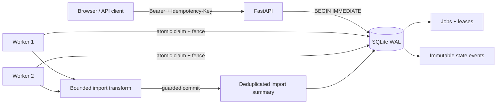

# Relay: durable workflows

Relay is a small service-request product that accepts a synthetic integer data import, persists it before work starts, processes it with concurrent workers, and keeps every state transition inspectable. It is designed to make backend failure behavior demonstrable on a laptop rather than hide it behind a hosted queue.


## What the user can do

Open the local UI, choose one of two synthetic identities, submit comma-separated integers, and watch the request move through `queued`, `running`, retry states, and a terminal result. The same owner can inspect its event history and Prometheus-style metrics. A second owner receives `404` for another owner's job, avoiding an identifier oracle.



The schema, idempotency record, initial job, and first event commit in one transaction. Claims use `BEGIN IMMEDIATE`, a lease owner, expiry, and a monotonically increasing fencing token. A stale worker cannot write a result after another worker has recovered its lease. Retries use bounded exponential delays and stop at a configured maximum. State events are immutable snapshots that implement the portfolio event envelope.

## Quick start

Requirements: Python 3.12+, [uv](https://docs.astral.sh/uv/), and `make`.

```bash
make setup
make test
make serve
```

Open [http://127.0.0.1:8111](http://127.0.0.1:8111). The bundled credentials are synthetic local-demo values:

| UI identity | Bearer credential | Server principal |
|---|---|---|
| Synthetic Alpha | `demo-alpha-token` | `synthetic-alpha` |
| Synthetic Beta | `demo-beta-token` | `synthetic-beta` |

They are intentionally public and unsafe for a public deployment. Setting `DW_ENV=public` makes startup reject the bundled credentials, tokens shorter than 32 characters, and tokens beginning with `demo-`. Supply a JSON token-to-principal map through `DW_PRINCIPALS_JSON` for an isolated deployment. The mapping stays server-side; API request bodies never choose a principal.

Run a complete temporary-server HTTP demonstration:

```bash
make demo
```

Or create a request manually while the service is running:

```bash
curl -sS http://127.0.0.1:8111/jobs \
  -H 'Authorization: Bearer demo-alpha-token' \
  -H 'Idempotency-Key: readme-example-0001' \
  -H 'Content-Type: application/json' \
  --data '{"kind":"data_import","records":[{"value":4},{"value":8},{"value":15}]}'
```

Use `GET /jobs`, `GET /jobs/{id}`, `GET /jobs/{id}/events`, `GET /events`, and `GET /metrics` with the same Authorization header. Interactive OpenAPI documentation is at `/docs`.

## Configuration

| Variable | Default | Purpose |
|---|---:|---|
| `DW_DB_PATH` | `data/durable.db` | SQLite file |
| `HOST` / `PORT` | `127.0.0.1` / `8111` | Explicit service binding |
| `DW_WORKER_COUNT` | `2` | Embedded workers, from 0 to 16 |
| `DW_MAX_ATTEMPTS` | `3` | Total processing attempts, from 1 to 10 |
| `DW_LEASE_SECONDS` | `2` | Claim lifetime; must outlast dependency timeout |
| `DW_DEPENDENCY_TIMEOUT_SECONDS` | `0.5` | Per-attempt dependency deadline |
| `DW_RETRY_BASE_SECONDS` / `DW_RETRY_CAP_SECONDS` | `0.05` / `0.5` | Bounded retry delay |
| `DW_DEPENDENCY_MODE` | `normal` | Controlled `normal`, `timeout`, or `error` mode |
| `DW_START_WORKERS` | `true` | Disable embedded workers when running standalone workers |
| `DW_ENV` | `local` | `public` enables credential safety checks |

For standalone workers, set `DW_START_WORKERS=false` on the API process and run one or more `uv run durable-worker`. All processes must share the same local SQLite file.

## Failure and delivery semantics

Job processing is **at least once**. A worker may run the deterministic transform again after its lease expires. The committed local import summary is deduplicated by the unique `(job_id, effect_key)` key and is written in the same SQLite transaction as the `succeeded` state. This proves one committed local summary per job under the tested single-host design. It does not prove exactly-once execution and does not extend to a future remote side effect. A remote integration would need an idempotency key or transactional outbox plus explicit reconciliation.

SQLite WAL supports multiple readers and serializes writes. This is a deliberate fit for a small, zero-infrastructure local demonstration. It is not a multi-host queue: network filesystems, leader election, horizontal database failover, and distributed clock behavior are outside the claim. Worker timeout is a caller deadline; Python cannot forcibly stop an already-running dependency thread, so dependencies must remain side-effect-free or implement their own cancellation/idempotency.

On restart, a job with an unexpired lease remains `running` until that lease expires. The next claim/recovery pass moves it to `retry_wait`, or to `failed` if it used its final attempt. Terminal `succeeded`, `failed`, and `cancelled` rows cannot transition again.

## Verification and evidence

```bash
uv sync --frozen
uv run ruff check .
uv run pytest
make benchmark
make demo
```

The tests include strict request rejection, idempotent replay and payload collision, cross-owner denial, immutable cancellation, timeout exhaustion, four competing workers, stale fencing, side-effect deduplication, and a real subprocess that exits after claiming before a replacement worker recovers the lease. `make benchmark` runs a labeled synthetic workload and writes a machine-readable receipt to [`evidence/benchmark.json`](evidence/benchmark.json) after it has been measured. Receipts include the source revision, pre-run dirty-tree state, exact command, environment, inputs, observed results, and limitations.

The Docker image is an alternative runtime:

```bash
docker build -t durable-workflows .
docker run --rm -p 127.0.0.1:8111:8111 \
  -e HOST=0.0.0.0 \
  -v "$PWD/data:/app/data" \
  durable-workflows
```

## Repository map

- `src/durable_workflows/app.py`: HTTP API, server-side identity, health, metrics, and UI serving.
- `src/durable_workflows/db.py`: schema, atomic idempotency, leases, fencing, transitions, events, and local result deduplication.
- `src/durable_workflows/worker.py`: bounded execution and retries.
- `static/`: responsive, dependency-free browser interface.
- `tests/`: API, authorization, concurrency, timeout, fencing, and process restart coverage.
- `scripts/`: real HTTP demonstration and reproducible benchmark.
- `docs/workflow-contract.md`: local copy of the applicable frozen portfolio contract.
- `INTERVIEW_GUIDE.md`: design explanation and hands-on exercises.

## License and data

The source and original synthetic fixtures are MIT licensed; see [LICENSE](LICENSE). The project downloads no dataset and imports no private data. Values created through the UI and test suite are synthetic integers stored only in the configured local SQLite file.

